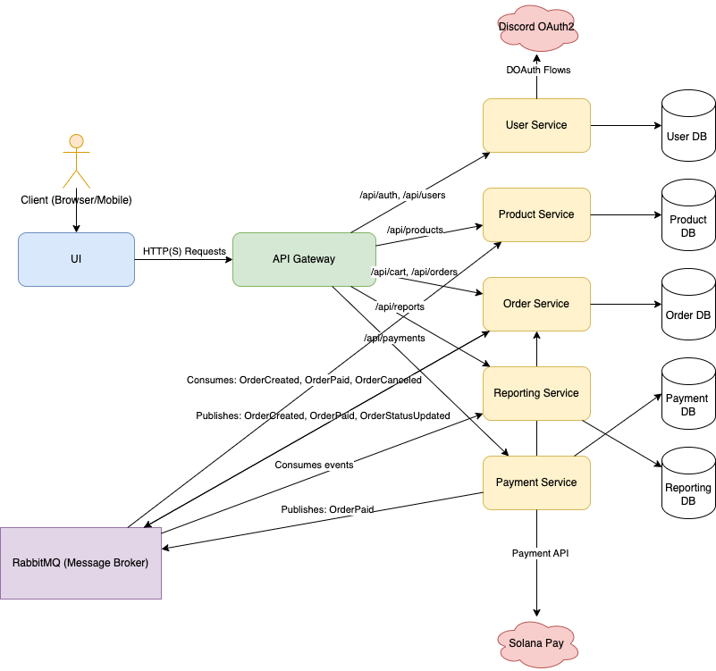

# System Design: E-commerce Platform

This document details the system architecture and design for the e-commerce platform as specified in `prd.md`.

## 1. High-Level Architecture

The system will be designed using a microservices architecture. This approach will split the backend into several independent, deployable services. An API Gateway will act as a single entry point for all client requests, routing them to the appropriate service. This architecture enhances scalability, maintainability, and flexibility.

*   **Frontend:** A client-side single-page application (SPA) built with **React (Next.js)** and **TypeScript**. The UI will be fully responsive (RWD) using a mobile-first approach to ensure a seamless experience across all devices, from desktops to mobile phones.
*   **API Gateway:** A single entry point that receives all frontend requests and routes them to the appropriate backend microservice. This will be built with **Node.js**.
*   **Backend Microservices:** A collection of independent services, each responsible for a specific business domain. They will be built with **Node.js**, **Express.js**, and **TypeScript**.
    *   **User Service:** Handles user authentication, registration, and profile management.
    *   **Product Service:** Manages the product catalog, including inventory.
    *   **Order Service:** Manages shopping carts, orders, and the checkout process.
    *   **Payment Service:** Handles payment processing and integration with Solana Pay.
*   **Database:** Each microservice will have its own dedicated **PostgreSQL** database to ensure loose coupling. We will use the **Prisma** ORM for type-safe database access within each service.
*   **Asynchronous Communication:** A message broker like **RabbitMQ** will be used for asynchronous communication between services (e.g., for event-based updates).



## 2. Component Design and Technology Choices

This section outlines the key design decisions for each major component of the system, presenting alternatives and justifying the final choice.

### 2.1. Architecture: Microservices vs. Monolith

*   **Option 1: Monolithic Architecture.** A single, unified application containing all backend logic (users, products, orders).
    *   *Pros:* Simpler to develop, test, and deploy initially. Less operational overhead at the start.
    *   *Cons:* Becomes difficult to scale and maintain as the application grows. A bug in one module can bring down the entire system. Technology stack is locked in.
*   **Option 2: Microservices Architecture.** The backend is split into small, independent services, each responsible for a specific business domain.
    *   *Pros:* Services can be developed, deployed, and scaled independently. Improved fault isolation. Teams can work autonomously. Flexibility to use different technologies for different services.
    *   *Cons:* More complex to set up and manage (requires an API Gateway, service discovery, inter-service communication). Potential for network latency between services.

*   **Decision: Microservices Architecture.**
*   **Justification:** The primary drivers for this project are scalability and maintainability. A microservices architecture provides the flexibility to scale individual parts of the system (e.g., the `Product Service` during a sale) and allows for better fault isolation, which is critical for a reliable e-commerce platform.

### 2.2. Frontend Framework

*   **Option 1: Next.js (React).** A popular React framework that offers Server-Side Rendering (SSR), Static Site Generation (SSG), and a great developer experience.
*   **Option 2: Vue.js (with Nuxt.js).** Another popular framework known for its gentle learning curve and excellent performance. Nuxt.js provides SSR capabilities similar to Next.js.
*   **Option 3: Angular.** A comprehensive, opinionated framework maintained by Google, well-suited for large enterprise applications.

*   **Decision: Next.js (React).**
*   **Justification:** Next.js provides a powerful combination of performance (through SSR/SSG for fast initial page loads and good SEO) and developer experience. The vast React ecosystem and the ability to use TypeScript seamlessly make it a robust choice for our user-facing application.

### 2.3. Backend Language & Framework

*   **Option 1: Node.js with Express.js/TypeScript.** Excellent for building fast, I/O-bound microservices. Allows for using a single language (TypeScript) across the entire stack.
*   **Option 2: Python with FastAPI.** Known for its high performance (comparable to Node.js) and automatic interactive API documentation. Python has a strong ecosystem for data science and ML, though that is not a primary requirement here.
*   **Option 3: Go with Gin.** Offers superior raw performance and low memory usage due to its compiled nature. Excellent for high-concurrency services, but has a steeper learning curve and a less mature ORM ecosystem compared to Node.js/Python.

*   **Decision: Node.js with Express.js and TypeScript.**
*   **Justification:** Using TypeScript across both frontend and backend (with Node.js) significantly reduces context-switching for developers and allows for code sharing (e.g., types and validation logic). The Node.js ecosystem is mature, and its non-blocking I/O model is perfectly suited for the typical workload of e-commerce microservices.

### 2.4. Database

*   **Option 1: PostgreSQL.** A powerful, open-source object-relational database known for its reliability, feature richness, and strong standards compliance.
*   **Option 2: MySQL.** The world's most popular open-source relational database. It is also highly reliable and performant.
*   **Option 3: MongoDB.** A leading NoSQL, document-oriented database that offers high flexibility and horizontal scalability.

*   **Decision: PostgreSQL.**
*   **Justification:** While the flexibility of MongoDB is tempting, the data in an e-commerce system (users, products, orders) is inherently relational. PostgreSQL provides strong data integrity through ACID compliance, which is critical for transactional data. Its excellent support for JSONB columns also offers a "best of both worlds" approach, allowing us to store less-structured data (like items in an order) efficiently within a relational model.

### 2.5. Asynchronous Communication

*   **Option 1: RabbitMQ.** A mature, feature-rich message broker that implements the AMQP protocol. It offers complex and flexible routing capabilities.
*   **Option 2: Apache Kafka.** A distributed streaming platform designed for high-throughput, fault-tolerant, and replayable event logs.
*   **Option 3: Redis Pub/Sub.** A lightweight, in-memory data store with basic pub/sub capabilities.

*   **Decision: RabbitMQ.**
*   **Justification:** Our system requires reliable, task-based communication between services (e.g., "Order placed, update inventory"). RabbitMQ excels at this "smart broker" pattern, where it can handle complex routing logic to ensure messages get to the right consumers to trigger specific actions. Kafka's primary strength is as a durable, replayable log, which is overkill for our transactional needs. Redis is too simplistic and lacks the durability and guaranteed delivery features of a dedicated message broker like RabbitMQ.

## 3. Database Schema

With a microservices architecture, each service will manage its own data in a separate database to ensure loose coupling. Here’s how the schema will be divided:

### 3.1. User Service (`user-db`)

```prisma
// prisma/schema.prisma in User Service

model User {
  id           String  @id @default(cuid())
  email        String  @unique
  discordId    String  @unique
}
```

### 3.2. Product Service (`product-db`)

```prisma
// prisma/schema.prisma in Product Service

model Product {
  id            String @id @default(cuid())
  name          String
  description   String
  price         Float
  imageUrl      String
  stock         Int
  preservedStock Int @default(0)
  walletAddress String
}
```

### 3.3. Order Service (`order-db`)

```prisma
// prisma/schema.prisma in Order Service

model Order {
  id        String      @id @default(cuid())
  userId    String      // ID from the User service
  status    OrderStatus @default(PROCESSING)
  total     Float
  items     Json        // Store a denormalized list of product details
  walletAddress String  // The wallet address associated with this order
  createdAt DateTime    @default(now())
}

model Cart {
    id        String   @id @default(cuid())
    userId    String   @unique
    items     Json     // Store a denormalized list of product details
    createdAt DateTime @default(now())
}

enum OrderStatus {
  PROCESSING
  PAID
  SHIPPED
  DELIVERED
  CANCELED
}
```

### 3.4. Payment Service (`payment-db`)

```prisma
// prisma/schema.prisma in Payment Service

model Payment {
  id          String  @id @default(cuid())
  orderId     String  @unique // ID from the Order service
  amount      Float
  status      String
  transaction String? // Solana transaction signature
  createdAt   DateTime @default(now())
}
```

## 4. API Endpoints

The API Gateway will expose the following endpoints, which will be routed to the appropriate microservice.

### 4.1. User Service

*   `GET /api/auth/discord`: Redirect to Discord for OAuth authentication.
*   `GET /api/auth/discord/callback`: Callback URL for Discord OAuth.
*   `POST /api/auth/logout`: Log out a user.
*   `GET /api/users/me`: Get the current user's profile.
*   `PUT /api/users/me`: Update the current user's profile.

### 4.2. Product Service

*   `GET /api/products`: Get a list of all products (with search and filtering).
*   `GET /api/products/:id`: Get a single product by ID.
*   `POST /api/products`: (Admin) Create a new product.
*   `PUT /api/products/:id`: (Admin) Update a product.
*   `DELETE /api/products/:id`: (Admin) Delete a product.

### 4.3. Order Service

*   `GET /api/cart`: Get the current user's cart.
*   `POST /api/cart/items`: Add an item to the cart.
*   `PUT /api/cart/items/:id`: Update the quantity of an item in the cart.
*   `DELETE /api/cart/items/:id`: Remove an item from the cart.
*   `POST /api/orders`: Create one or more new orders from the user's cart. The items in the cart are grouped by their `walletAddress`, and a separate order is created for each wallet address.
*   `GET /api/orders`: Get a list of the current user's orders.
*   `GET /api/orders/:id`: Get a single order by ID.
*   `GET /api/admin/orders`: (Admin) Get a list of all orders.
*   `PUT /api/admin/orders/:id/status`: (Admin) Update the status of an order.

### 4.4. Payment Service

*   `POST /api/payments/charge`: Initiate a payment for an order.
*   `GET /api/payments/verify`: Verify a payment with Solana Pay.

## 5. Project Structure

The project will be organized into a monorepo structure, with separate packages for the frontend, API gateway, and each microservice.

```
/
|-- packages/
|   |-- client/ (Next.js Frontend)
|   |   |-- components/         # Reusable React components
|   |   |-- pages/              # Next.js pages and API routes
|   |   |-- public/             # Static assets
|   |   |-- styles/             # Global styles
|   |   |-- utils/              # Utility functions
|   |   |-- tsconfig.json
|   |   `-- package.json
|   |
|   |-- api-gateway/ (Node.js API Gateway)
|   |   |-- src/
|   |   |   `-- index.ts
|   |   |-- tsconfig.json
|   |   `-- package.json
|   |
|   |-- user-service/
|   |   |-- src/
|   |   |-- prisma/
|   |   |-- tsconfig.json
|   |   `-- package.json
|   |
|   |-- product-service/
|   |   |-- src/
|   |   |-- prisma/
|   |   |-- tsconfig.json
|   |   `-- package.json
|   |
|   |-- order-service/
|   |   |-- src/
|   |   |-- prisma/
|   |   |-- tsconfig.json
|   |   `-- package.json
|   |
|   `-- payment-service/
|       |-- src/
|       |-- prisma/
|       |-- tsconfig.json
|       `-- package.json
|
|-- .gitignore
|-- package.json
`-- README.md
```
